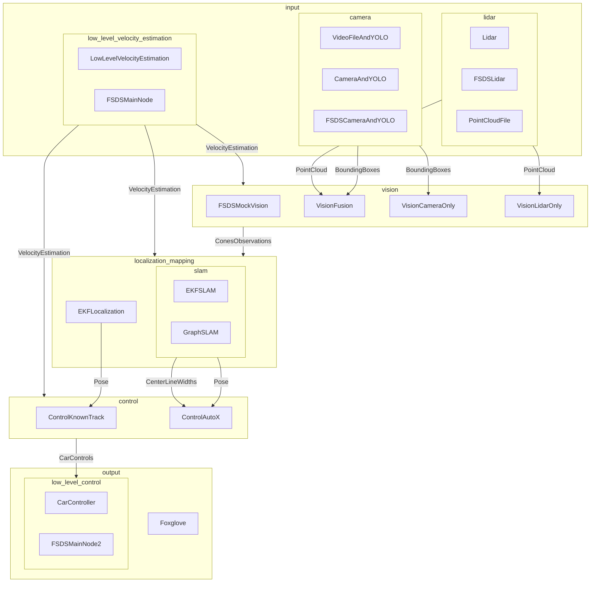

# Whole pipeline

```mermaid
flowchart TB
    subgraph input
        subgraph camera
            VideoFileAndYOLO
            CameraAndYOLO
            FSDSCameraAndYOLO
        end
        subgraph lidar
            Lidar
            FSDSLidar
            PointCloudFile
        end
        subgraph low_level_velocity_estimation
            LowLevelVelocityEstimation
            FSDSMainNode
        end
    end
    subgraph output
        subgraph low_level_control
            CarController
            FSDSMainNode2
        end
        Foxglove
    end
    subgraph vision
        FSDSMockVision
        VisionFusion
        VisionCameraOnly
        VisionLidarOnly
    end
    subgraph localization_mapping
        EKFLocalization
        subgraph slam
            EKFSLAM
            GraphSLAM
        end
    end
    subgraph control
        ControlKnownTrack
        ControlAutoX
    end

    %% vision input
    camera -- BoundingBoxes --> VisionCameraOnly & VisionFusion
    lidar -- PointCloud --> VisionLidarOnly & VisionFusion
    %% vision output
    vision -- ConesObservations --> localization_mapping
    %% sensors output
    %% sensors -- IMUData --> velocity_estimation
    %% sensors -- GSSData --> velocity_estimation
    %% sensors -- WSSData --> velocity_estimation
    %% VE output
    low_level_velocity_estimation -- VelocityEstimation --> vision & localization_mapping & control
    %% localization_mapping output
    EKFLocalization -- Pose --> ControlKnownTrack
    slam -- Pose --> ControlAutoX
    slam -- CenterLineWidths --> ControlAutoX
    %% control output
    control -- CarControls --> low_level_control
    %% extra
    %% RES?

```

# Control only

# Vision & loc only

#
