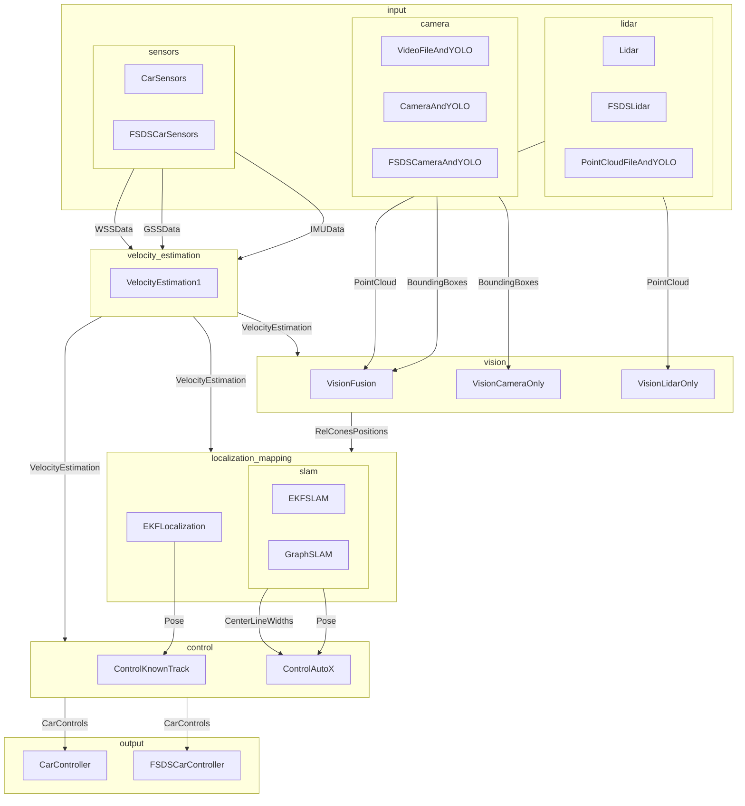

```mermaid
flowchart TB
    subgraph input
        subgraph camera
            VideoFileAndYOLO
            CameraAndYOLO
            FSDSCameraAndYOLO
        end
        subgraph lidar
            Lidar
            FSDSLidar
            PointCloudFileAndYOLO
        end
        subgraph sensors
            CarSensors
            FSDSCarSensors
        end
    end
    subgraph output
        CarController
        FSDSCarController
    end
    subgraph vision
        VisionFusion
        VisionCameraOnly
        VisionLidarOnly
    end
    subgraph velocity_estimation
        VelocityEstimation1
    end
    subgraph localization_mapping
        EKFLocalization
        subgraph slam
            EKFSLAM
            GraphSLAM
        end
    end
    subgraph control
        ControlKnownTrack
        ControlAutoX
    end
    %% vision input
    camera -- BoundingBoxes --> VisionCameraOnly & VisionFusion
    lidar -- PointCloud --> VisionLidarOnly & VisionFusion
    %% vision output
    vision -- RelConesPositions --> localization_mapping
    %% sensors output
    sensors -- IMUData --> velocity_estimation
    sensors -- GSSData --> velocity_estimation
    sensors -- WSSData --> velocity_estimation
    %% VE output
    velocity_estimation -- VelocityEstimation --> vision & localization_mapping & control
    %% localization_mapping output
    EKFLocalization -- Pose --> ControlKnownTrack
    slam -- Pose --> ControlAutoX
    slam -- CenterLineWidths --> ControlAutoX
    %% control output
    control -- CarControls --> CarController & FSDSCarController

```
