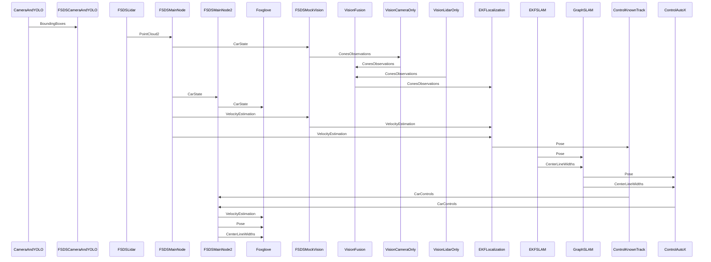
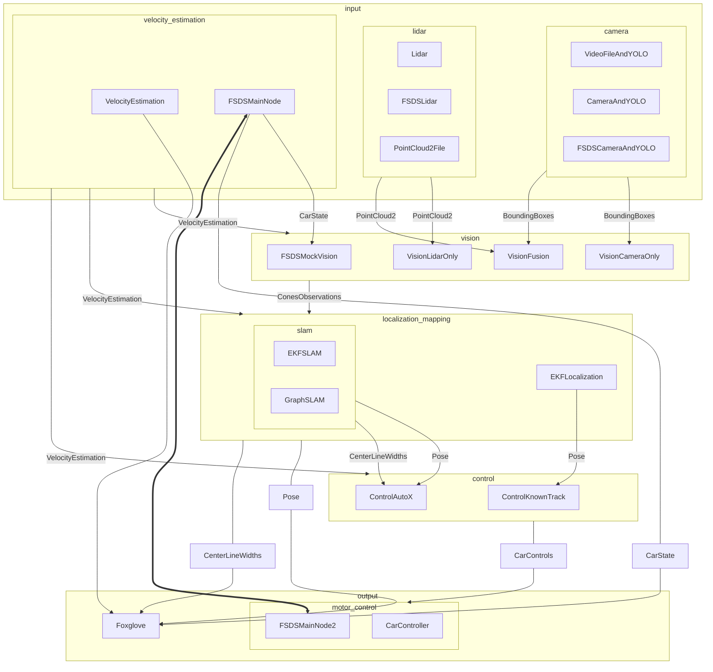

# Whole pipeline
## FSDS version

```mermaid
sequenceDiagram
    participant CameraAndYOLO
    participant FSDSCameraAndYOLO
    participant FSDSLidar
    participant FSDSMainNode
    participant FSDSMainNode2
    participant Foxglove
    participant FSDSMockVision
    participant VisionFusion
    participant VisionCameraOnly
    participant VisionLidarOnly
    participant EKFLocalization
    participant EKFSLAM
    participant GraphSLAM
    participant ControlKnownTrack
    participant ControlAutoX
    CameraAndYOLO ->> FSDSCameraAndYOLO: BoundingBoxes
    FSDSLidar ->> FSDSMainNode: PointCloud2
    FSDSMainNode ->> FSDSMockVision: CarState
    FSDSMockVision ->> VisionCameraOnly: ConesObservations
    VisionCameraOnly ->> VisionFusion: ConesObservations
    VisionLidarOnly ->> VisionFusion: ConesObservations
    VisionFusion ->> EKFLocalization: ConesObservations
    FSDSMainNode ->> FSDSMainNode2: CarState
    FSDSMainNode2 ->> Foxglove: CarState
    FSDSMainNode ->> FSDSMockVision: VelocityEstimation
    FSDSMockVision ->> EKFLocalization: VelocityEstimation
    FSDSMainNode ->> EKFLocalization: VelocityEstimation
    EKFLocalization ->> ControlKnownTrack: Pose
    EKFSLAM ->> GraphSLAM: Pose
    EKFSLAM ->> GraphSLAM: CenterLineWidths
    GraphSLAM ->> ControlAutoX: Pose
    GraphSLAM ->> ControlAutoX: CenterLineWidths
    ControlKnownTrack ->> FSDSMainNode2: CarControls
    ControlAutoX ->> FSDSMainNode2: CarControls
    FSDSMainNode2 ->> Foxglove: VelocityEstimation
    FSDSMainNode2 ->> Foxglove: Pose
    FSDSMainNode2 ->> Foxglove: CenterLineWidths
    %% FSDSMainNode2 <=====> FSDSMainNode2
```

## LRT4 version

```mermaid
flowchart TB
    subgraph input
        subgraph camera
            VideoFileAndYOLO
            CameraAndYOLO
            FSDSCameraAndYOLO
        end
        subgraph lidar
            Lidar
            FSDSLidar
            PointCloud2File
        end
        subgraph velocity_estimation
            VelocityEstimation
            FSDSMainNode
        end
    end
    subgraph output
        subgraph motor_control
            CarController
            FSDSMainNode2
        end
        Foxglove
    end
    subgraph vision
        FSDSMockVision
        VisionFusion
        VisionCameraOnly
        VisionLidarOnly
    end
    subgraph localization_mapping
        EKFLocalization
        subgraph slam
            EKFSLAM
            GraphSLAM
        end
    end
    subgraph control
        ControlKnownTrack
        ControlAutoX
    end
    FSDSMainNode -- CarState --> FSDSMockVision
    %% vision input
    camera -- BoundingBoxes --> VisionCameraOnly & VisionFusion
    lidar -- PointCloud2 --> VisionLidarOnly & VisionFusion
    %% vision output
    vision -- ConesObservations --> localization_mapping
    %% sensors output
    %% sensors -- IMUData --> velocity_estimation
    %% sensors -- GSSData --> velocity_estimation
    %% sensors -- WSSData --> velocity_estimation
    %% VE output
    velocity_estimation -- VelocityEstimation --> vision & localization_mapping & control
    %% localization_mapping output
    EKFLocalization -- Pose --> ControlKnownTrack
    slam -- Pose --> ControlAutoX
    slam -- CenterLineWidths --> ControlAutoX
    %% control output
    control --- CarControls --> motor_control
    %% extra
    FSDSMainNode --- CarState --> Foxglove
    velocity_estimation --- VelocityEstimation --> Foxglove
    localization_mapping --- Pose --> Foxglove
    localization_mapping --- CenterLineWidths --> Foxglove
    FSDSMainNode <=====> FSDSMainNode2
```

# Control only

# Vision & loc only

#
